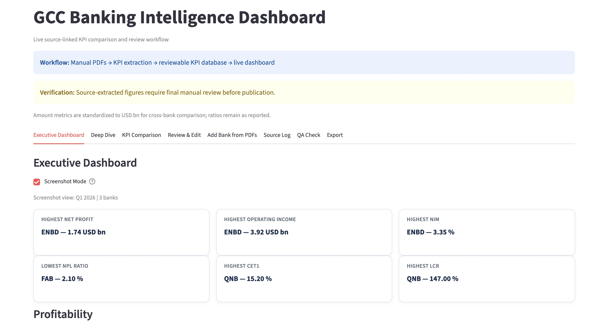
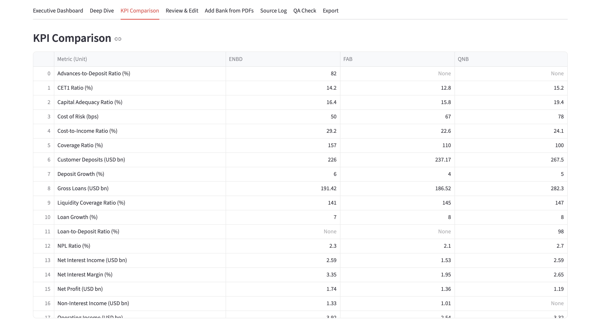
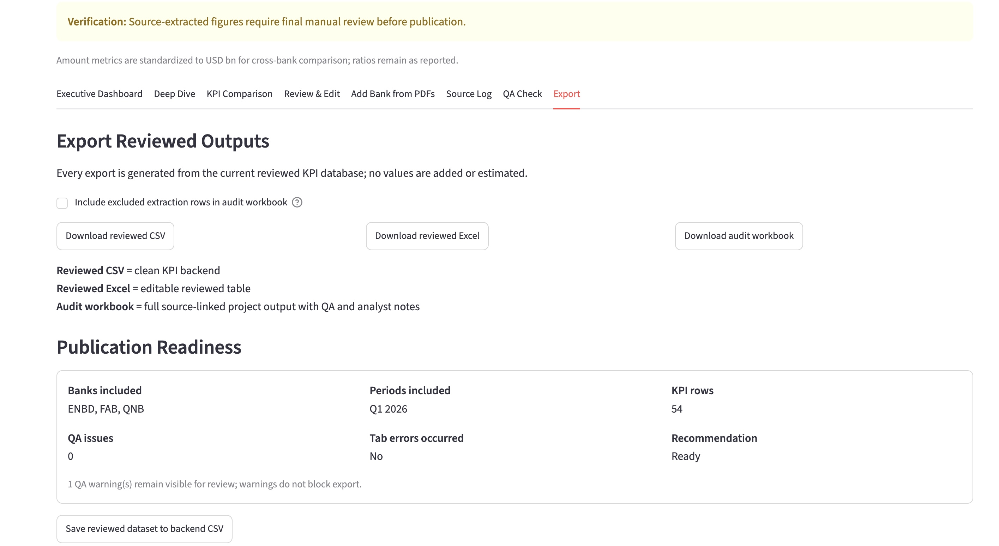
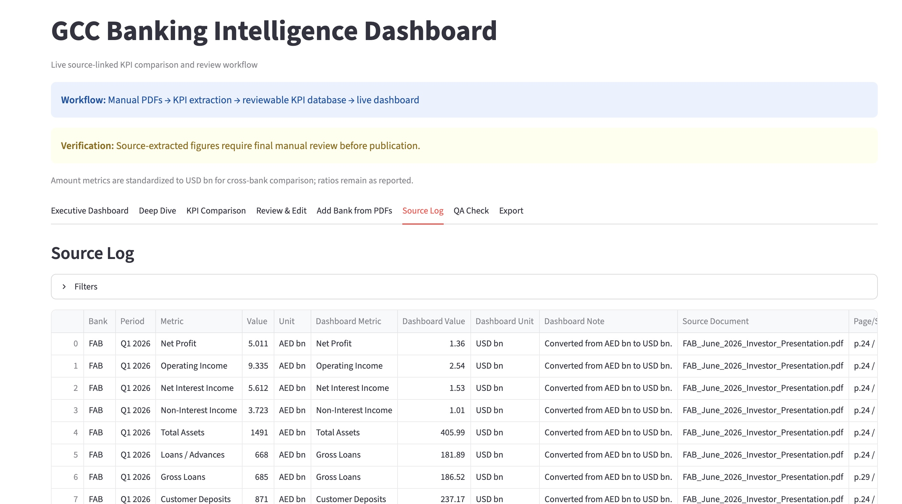

# AI-Assisted GCC Banking Intelligence Dashboard

A Python and Streamlit project that turns official bank disclosures into a reviewed, source-linked KPI database and an interactive GCC banking dashboard.

The dashboard currently compares **First Abu Dhabi Bank (FAB)**, **Emirates NBD (ENBD)**, and **QNB Group** for **Q1 2026**, with amount metrics standardized to **USD bn** for cross-bank comparison.

This project was built as a finance portfolio project to demonstrate practical skills in:

* financial statement KPI extraction
* banking analysis
* PDF data ingestion
* source-linked audit trails
* currency standardization
* dashboard design
* QA-controlled financial data workflows

---

## Dashboard Preview

### Executive Dashboard



### KPI Comparison



### Publication Readiness



### Source Log



---

## Project Objective

The objective is to build a repeatable workflow for comparing GCC banks using official disclosures.

The project does **not** treat AI/PDF extraction as automatically verified. Instead, it follows a controlled workflow:

```text
Official PDFs → KPI extraction → reviewable KPI database → QA checks → live dashboard → audit workbook
```

Every extracted figure is treated as a draft until reviewed against the source document and page reference.

---

## Current Banks Covered

The current reviewed dataset includes:

| Bank                       | Period  |
| -------------------------- | ------- |
| First Abu Dhabi Bank (FAB) | Q1 2026 |
| Emirates NBD (ENBD)        | Q1 2026 |
| QNB Group                  | Q1 2026 |

---

## Key Metrics

The dashboard tracks banking KPIs across profitability, balance sheet growth, asset quality, capital, and liquidity.

Examples include:

* Net Profit
* Operating Income
* Net Interest Income
* Non-Interest Income
* Total Assets
* Loans / Advances
* Gross Loans
* Customer Deposits
* Net Interest Margin
* Cost-to-Income Ratio
* NPL Ratio
* Coverage Ratio
* Liquidity Coverage Ratio
* Loan-to-Deposit Ratio
* CET1 Ratio
* Capital Adequacy Ratio
* Loan Growth
* Deposit Growth
* Cost of Risk

---

## Main Features

### 1. Executive Dashboard

The main dashboard summarizes cross-bank performance using KPI cards, charts, and comparison tables.

It answers questions such as:

* Which bank has the highest net profit?
* Which bank has the strongest operating income?
* Which bank has the highest NIM?
* Which bank has the lowest NPL ratio?
* Which bank has the strongest CET1 ratio?
* Which bank has the strongest liquidity coverage ratio?

---

### 2. Add Bank from PDFs

The app includes a workflow for adding a new bank from official PDF files.

The process is:

```text
Upload official bank PDFs
→ extract draft KPI rows
→ review/edit extracted values
→ exclude failed or low-confidence rows
→ apply reviewed rows to dashboard
```

The extraction workflow supports:

* page text extraction
* table extraction
* metric alias matching
* source document tracking
* page/section references
* confidence scoring
* excluded failed rows
* draft review before dashboard application

The app does not automatically mark extracted figures as verified.

---

### 3. Source Log

The Source Log shows the audit trail behind each KPI, including:

* Bank
* Period
* Metric
* Original value
* Original unit
* Dashboard standardized value
* Dashboard standardized unit
* Source document
* Page or section
* Verification status
* Notes

This is designed to make every dashboard figure traceable.

---

### 4. QA Check

The QA tab checks the reviewed dataset for issues such as:

* missing required columns
* missing values
* missing source documents
* missing page references
* duplicate bank/period/metric rows
* mixed or unrecognized units
* suspicious banking ratios
* currency standardization issues

The dashboard is considered publication-ready only when no major QA issues remain.

---

### 5. Export Reviewed Outputs

The app can export:

* reviewed CSV
* reviewed Excel file
* audit workbook

The audit workbook includes:

* reviewed KPI database
* pivot comparison
* source log
* QA check
* analyst notes template

---

## Currency Standardization

Banks report in different currencies and units. To make cross-bank comparison possible, amount metrics are standardized to **USD bn** for dashboard display.

Default FX assumptions used for dashboard comparability:

```text
AED/USD = 3.6725
QAR/USD = 3.6405
```

Ratios are not converted. Metrics such as NIM, NPL ratio, CET1 ratio, CAR, LCR, and cost-to-income ratio remain as reported.

Currency conversion is used only for dashboard comparability, not valuation precision.

---

## Project Structure

```text
finance-analyst-workflow/
├── .agents/skills/
├── configs/
├── docs/
├── scripts/
├── screenshots/
├── tests/
├── README.md
├── requirements.txt
└── streamlit_app.py
```

Raw PDFs are intentionally excluded from the repository.

---

## Data Policy

Official bank PDFs are the source of record.

Raw PDF files are excluded from the GitHub repository to avoid redistributing source documents. The app is designed to work with PDFs added locally or uploaded through the Streamlit interface.

The processed KPI dataset is a reviewed working dataset derived from official disclosures and should still be checked against original source documents before any external use.

---

## Setup

Create and activate a virtual environment:

```bash
python3 -m venv .venv
source .venv/bin/activate
```

Install requirements:

```bash
pip install -r requirements.txt
```

---

## Run the Streamlit App

From the repository root:

```bash
streamlit run streamlit_app.py
```

Then open:

```text
http://localhost:8501
```

---

## Adding a New Bank from PDFs

To add a new bank:

1. Open the Streamlit app.
2. Go to the **Add Bank from PDFs** tab.
3. Enter the bank name.
4. Enter the reporting period.
5. Upload the official bank PDFs.
6. Click **Extract KPIs**.
7. Review the extracted KPI draft.
8. Check excluded rows and low-confidence rows.
9. Apply only reviewed High/Medium confidence rows.
10. Run the QA Check.
11. Export the audit workbook.
12. Save the reviewed dataset only after review.

Recommended source files for quarterly dashboards:

* quarterly investor presentation
* quarterly financial results
* quarterly financial statements
* earnings release or results announcement

Avoid mixing annual reports into a quarterly dashboard unless the annual report is being used only as a reference source.

---

## Extraction Philosophy

The project uses AI-assisted and rule-based extraction to accelerate the workflow, but it does not replace analyst judgment.

The extraction layer is designed to:

* identify likely KPI candidates
* capture source references
* reject suspicious values
* flag missing or low-confidence outputs
* preserve failed rows for review
* prevent unverified values from entering the dashboard automatically

Final values require review before external publication.

---

## Tests

Run tests with:

```bash
pytest
```

The tests cover areas such as:

* PDF KPI ingestion logic
* currency standardization
* rejection of weak candidates
* conversion of banking amount metrics into USD bn

---

## Current Status

The current dashboard includes:

```text
Banks: ENBD, FAB, QNB
Period: Q1 2026
KPI rows: 54
QA issues: 0
Publication readiness: Ready
```

One remaining QA warning may appear for currency conversion notes. This does not block publication because amount metrics are intentionally standardized to USD bn for comparison.

---

## Limitations

This project is an educational finance analytics project.

It is not investment advice.

Figures should be checked against the original bank disclosures before being used in professional research, valuation, or investment decision-making.

Potential limitations include:

* PDF extraction may miss or misread complex tables.
* Metric definitions may vary across banks.
* Some banks report in different currencies or reporting formats.
* Quarterly and annual disclosures should not be mixed without clear labeling.
* Extracted values require manual review before publication.

---

## Recruiter-Facing Summary

This project demonstrates a practical finance analytics workflow:

```text
Official bank PDFs → source-linked KPI extraction → reviewed KPI database → QA checks → live dashboard → audit workbook
```

It combines financial analysis, Python automation, Streamlit dashboarding, and source-controlled verification to compare GCC banks in a more scalable and auditable way than a traditional manual spreadsheet workflow.
